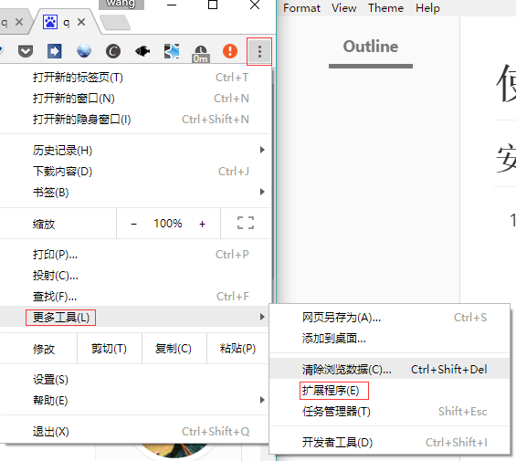
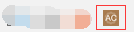
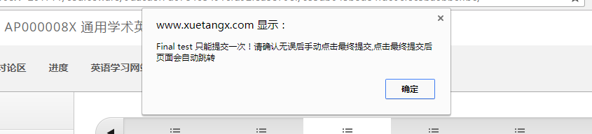

# 使用说明

## 安装

1. 打开chrome浏览器，打开**扩展程序**页面。

2. 点击**加载已解压的扩展程序**

   

3. 选中文件夹并点击确定

4. chrome扩展栏中出现如图的图标，表示安装成功。

## 使用

进入学堂在线的课程页面，视频会自动播放并自动完成课后题目，视频播放结束后会自动进入下一节学习。

如果确实有不灵的时候，请刷新页面，如果还不行，请按F12查看控制台信息并反馈给我。

## 关于期末考试

**期末考试只能提交一次，为了安全起见改为手动提交。**

1. 点开期末考试页面后会弹出一个提示框:

2. 点击确定后选项会被自动填充。**确认无误后手动点击“最终提交”**，然后会**自动跳转到下一页**。

如果手动切换了页面或其他的原因导致了提示框没有弹出或者选项没有自动填充，请按`F5`刷新页面。

## 卸载

使用结束后，可以前往**扩展程序页面**卸载。

也可以在下次打开chrome浏览器时按照系统的提示卸载。

---

在使用中如果有任何问题请联系gerwang@outlook.com。

感谢n+e和他的小伙伴们的答案！