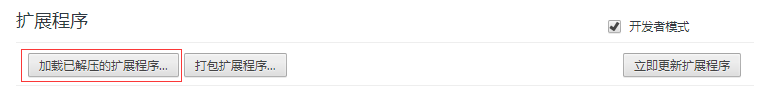
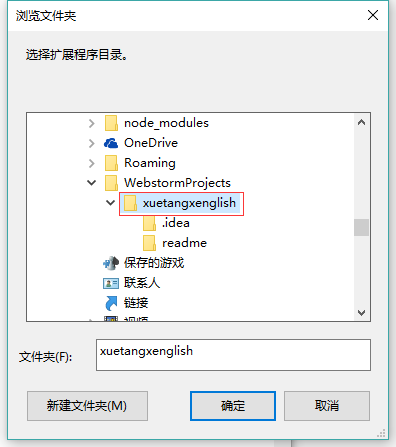

# 使用说明

## 安装

1. 打开chrome浏览器，打开**扩展程序**页面。

2. 点击**加载已解压的扩展程序**

   

3. 选中文件夹并点击确定

4. chrome扩展栏中出现如图的图标，表示安装成功。

## 使用

进入学堂在线的课程页面，视频会自动播放并自动完成课后题目，视频播放结束后会自动进入下一节学习。

## 卸载

使用结束后，可以前往**扩展程序页面**卸载。

也可以在下次打开chrome浏览器时按照系统的提示卸载。

---

在使用中如果有任何问题请联系gerwang@outlook.com。

最后祝您，身体健康。